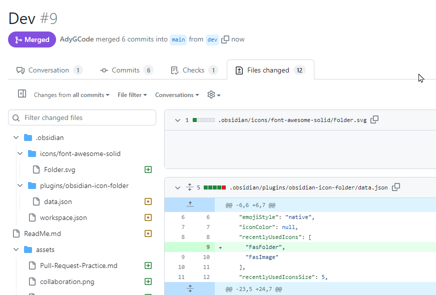

# Diffs

A diff is a standard representation of the difference between text files or sets of text files.

Diffs are designed to be human readable but IDEs can make them easier to work with.

They provide enough fidelity to be used as a patch to the code you are working on.

When you run `git status` the question is “what is the diff?”

When you run a merge – it is asking the same question.

Pull or push – yep, you guessed it...

### Git Merge explained using Soldiers

<iframe width="560" height="315" src="https://www.youtube.com/embed/4zw7dO46XSQ?si=0ssNcD8S-ukHV3R4" title="YouTube video player" frameborder="0" allow="accelerometer; autoplay; clipboard-write; encrypted-media; gyroscope; picture-in-picture; web-share" allowfullscreen></iframe>


## What is the difference?

We will want to know there is a difference, but this is often not enough.

When we know there is a difference, we then want to know what the difference is.

You saw an example of differences when you ran a pull request.



## When can diffs be seen?

You are able to view diffs between a number of 'objects' that make up the Git version control 'history'.

You may look at diffs between:

- Files
- Commits
- Staging (index) and the object database (repo)
- The working copy and any of the above

# Diff Interpretation

### Header

The header shows the files being compared. The two versions of the file being compared are represented by `-` and `+`.

| Symbol | Version     |
| ------ | ----------- |
| `+`    | New Version |
| `-`    | Old Version |

These two symbols are associated with each insertion.

For temporally related changes, an insertion in the past is a deletion in the present.


### Hunk headers

The hunk headers indicate the line numbers that are affected in the ‘-’ file and the ‘+’ file.


### A difference!

The differences are indicated by `+` and `-`, and associated with the relevant files.

| Symbol | File   | Version                 |
| ------ | ------ | ----------------------- |
| `-`    | `---`  | Original                |
| `+`    | `+++`  | New                     |
|        | common | No change between files |

For example:
```diff
 def main():  
-    greet("Alice")  
+    name = input("Please enter your name: ")  
+    greet(name)  
```


### Challenge

What line numbers in each file do these changes relate to?

## Git Diff Explained

<iframe width="560" height="315" src="https://www.youtube.com/embed/vXN50AmJjgY?si=-hRWjzRZfKLPoOtt" title="YouTube video player" frameborder="0" allow="accelerometer; autoplay; clipboard-write; encrypted-media; gyroscope; picture-in-picture; web-share" allowfullscreen></iframe>


# References

Content based on the following:

www.oreilly.com. (n.d.). _3. Looking Around: Investigating Your Git Repository - Head First Git [Book]_. [online] Available at: https://learning.oreilly.com/library/view/head-first-git/9781492092506/ch03.html [Accessed 14 Mar. 2024].

www.youtube.com. (n.d.). _Git Diff - Explained_. [online] Available at: https://www.youtube.com/watch?v=vXN50AmJjgY [Accessed 15 Mar. 2024].


[Forking](14-forking-over-code/md) | [Undoing changes](16-oopsy-undoing-changes.md)
