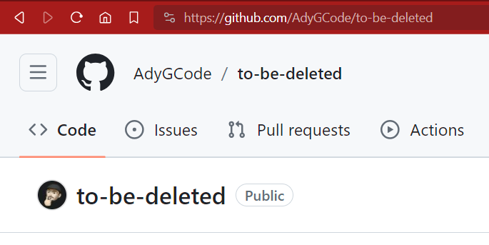
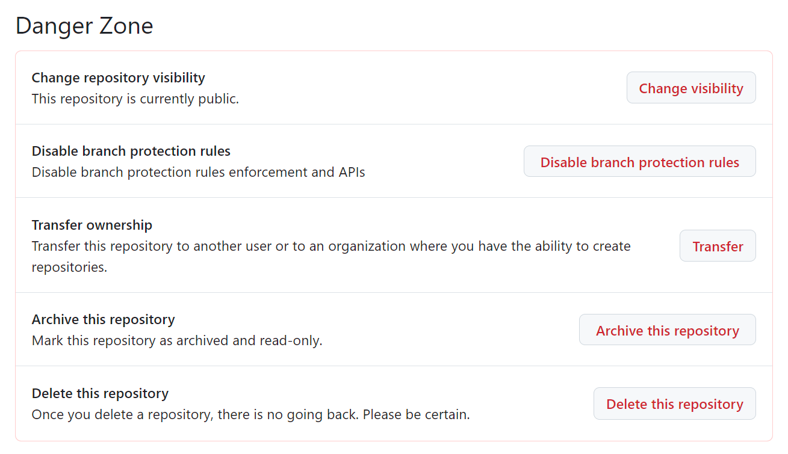
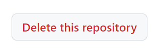
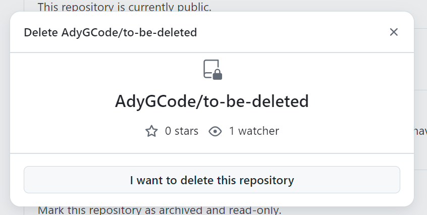
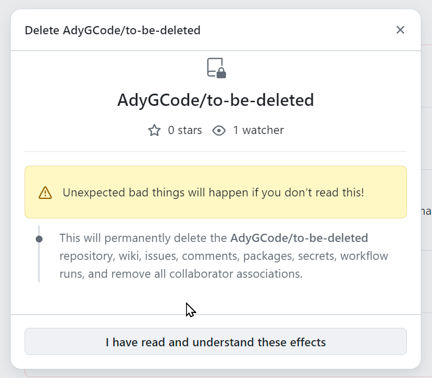
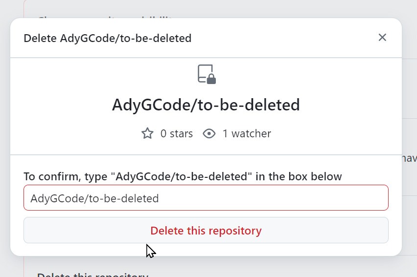
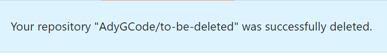

# Deleting A GitHub Repo
One thing you may need to do from time to time is to delete a repository from GitHub.

It is possible to do so from within the GitHub user interface.

Follow the steps below.

1. Log into your GitHub account
2. Within the GitHub web interface, locate and open the repository to be removed.
   
3. On the menu, find the Settings button and click this.
   
4. Scroll down the (general) page until you reach the **Danger Zone**.
      
5. Click the "**Delete this repository**" button.
   
6. Click the "**I want to delete this repository**" button.
   
7. Verify that you want to delete the repo and click the "**I have read and understand these effects**" button.
   
8. You will now have to type in the repository name to confirm deletion.
   
9. Click the "**Delete this repository**" button after typing int he repo name.
   
10. If all goes well, you will receive a success notification
    

(Back to Index)[../ReadM.md]
