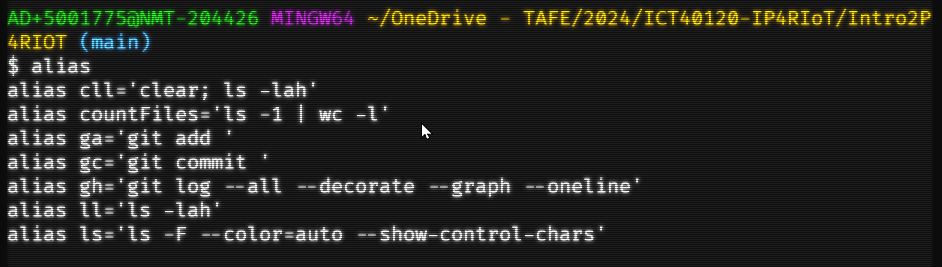

# Command Line Extras

In this section we will give you some hints and tips to help make your CLI experience more fluid and productive.

We split them into three parts. Windows, Linux and MacOS.

Many hints and tips for MacOS and Linux will be the same.

## Windows Command 

- TODO: Add Command Hints for Windows Command 

## Windows Git Bash 

The best hint or tip we can give is the following...

### Listing Aliases

To list the aliases that are already set use:

```shell
alias
```

If there are any aliases created, they will be listed similar to this:



### Adding Aliases

To do this we open a Bash CLI in Terminal and then enter: 

```shell
code ~/.bashrc
```

When it asks to create a new file, accept this.

In the file add the following general Bash aliases for things like listing files:

```bash
# ---------------------------------------------
# General aliases for bash CLI
# ---------------------------------------------

# Clear the screen, and list all files
alias cll='clear; ls -lah'
# count the number of files in the current folder
alias countFiles='ls -1 | wc -l'
# Long List all files
alias ll='ls -lah'
# short List files
alias ls='ls -F --color=auto --show-control-chars'
# short list all files
alias las='ls -a -F --color=auto --show-control-chars'

```

If you want to shorten your Git commands then the following could be useful:

```bash
# ---------------------------------------------
# Git Aliases plus example use
# ---------------------------------------------

# Git Add: ga FILENAME
alias ga='git add'
# Git Commit: gc -m MESSAGE
alias gc='git commit'
# Git Pull: gpl
alias gpl='git pull'
# Git Push: gps -u origin main
alias gps='git push'
# Git History: gh
alias gh='git log --all --decorate --graph --oneline'
```

If you make these changes and wish to activate them without closing and reopening Terminal, then use:

```bash
source ~/.bashrc
```


## MacOS Zshell

- TODO: Add Command Hints for MacOS zshell

For MacOS using zshell, you would create or edit the `~/.zshrc` file. **to verify**

## Linux Bash

For the main part, you may use the Windows Git Bash aliases for Linux without any issues.

Likewise use the `source ~/.bashrc` command to activate the aliases without having to close and reopen the terminal, Warp or iTerm.

